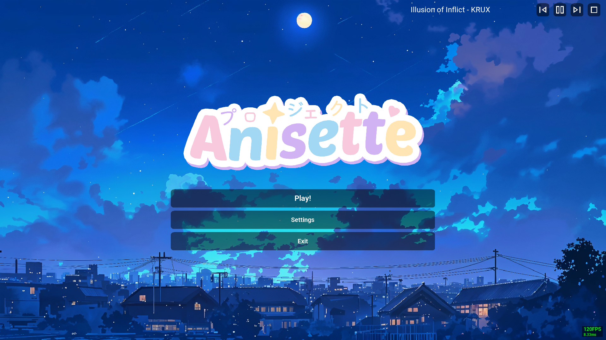
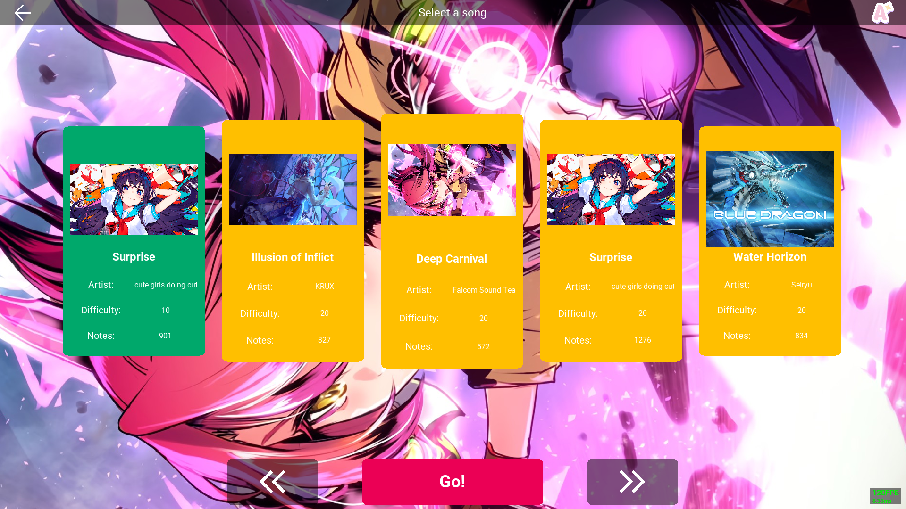
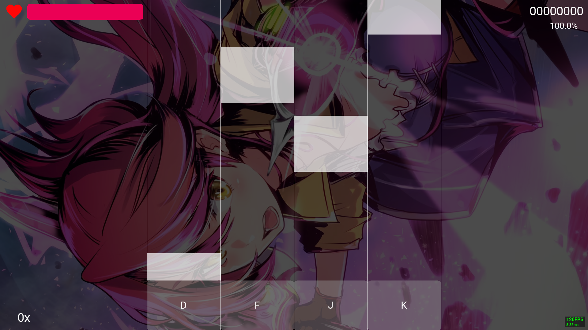

# Anisette

This is a rhythm game. Tap the notes in the right time!

[](https://github.com/im-yuuki/AnisetteProject/actions/workflows/build-release.yml)

## Preview





## Installation

Check [releases](https://github.com/im-yuuki/AnisetteProject/releases) and download the latest version available for your platform if there is.

Alternatively, you can check [GitHub Actions](https://github.com/im-yuuki/AnisetteProject/actions) to get the nightly build artifacts.

## Build

First, make a local clone of my repository. You need to fetch all git submodules to build the project.

```bash
git clone --recurse-submodules https://github.com/im-yuuki/AnisetteProject.git
```

On Windows, I recommend using Visual Studio 2022 Build Tools (MSVC).

Open the Developer Command Prompt for Visual Studio 2022 and then run below command in the project root directory.

```bash
cmake -S . --preset x64-windows-rel
```

If you want to build for Linux, first install the required dependencies.

```bash
sudo apt update
sudo apt install -y build-essential cmake ninja-build
cmake -S . --preset x64-linux-rel
```

Run this command to build all targets.

```bash
cmake --build build\x64-windows-rel --target Anisette --config Release
```

```bash
cmake --build build/x64-linux-rel --target Anisette --config Release
```

Go to `build/<your-platform>-rel/bin` and get the executable file along with .dll/.so files.

***NOTE: You must copy or symlink the `assets` folder to the same directory as the executable before run it.***

## References
